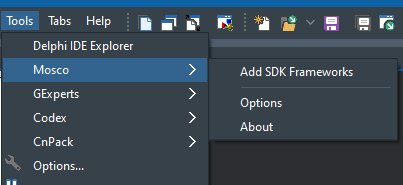
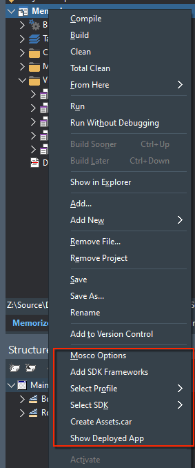
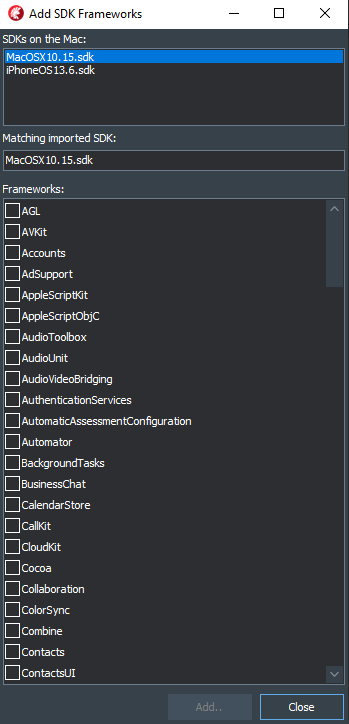

# Mosco Expert

## Description

Delphi add-in that provides functionality specific to macOS and iOS development

Support for Delphi 10.3.x Rio and Delphi 10.4 Sydney

Requires the macOS companion app for some of the functions. The full version of the Mosco macOS app is yet to be released, however the add-in also works with the MonkeyBuilder edition of the app, which can be found here:

~~MonkeyBuilder downloads~~

A **temporary** location for the [MonkeyBuilder edition of the Mosco macOS app installer is here](https://github.com/DelphiWorlds/MoscoExpert/blob/master/Bin/MoscoMBEdition.1.0.2.pkg)

Basic help for the [Mosco macOS app is here.](MoscoMBApp.md)

## Installers for the add-in

Please find installers in the bin folder. 

## Mosco functions

### Menu items

The expert adds items to the Tools menu:

..and to the Project Manager context menu i.e. the one that appears when you right-click a project in the Project Manager:

### Options

Click Mosco Options to configure the address/port for the macOS app, and for error logging

### Functions that will work only when the Mosco macOS app is running:

#### Add SDK Frameworks

Allows you to add available frameworks to the selected SDK. The following dialog is presented:

Select the desired SDK that you wish to import frameworks for, then select the desired frameworks, and click Add. 

The SDK Manager in the IDE Options is then presented. Click Update Local File Cache and click Save to complete the import

#### Show Deployed App

Opens Finder on the Mac, and shows the deployed app (if it has been deployed)

#### Update Assets.car

**NOTE: The following instructions apply to Mosco Expert 1.0.0 Beta 10 or later, and Mosco App (for macOS) 1.0.2 Beta 9 or later**

Updates the Assets.car file in the deployment to Ad-Hoc or App Store.

This function has been created specifically to alleviate an issue with [App Store submissions where a 1024 x 1024 icon is not included with the app](https://quality.embarcadero.com/browse/RSP-29692)

**You will need to create a 1024 x 1024 image for use in the App Store and add it using Deployment Manager**

To update the Assets.car file:

1. Deploy the app in App Store or Ad Hoc mode (using Project|Deploy), then
2. Use the Update Assets.car menu item so that Mosco updates the Assets.car contained in the .ipa file on the Mac 

The Assets.car file is based upon the icon and launch images deployed with the app. For successful creation of Assets.car, your deployment should contain at least **one** image of each of the following sizes:

* 40 x 40
* 58 x 58
* 60 x 60
* 80 x 80
* 87 x 87
* 120 x 120
* 152 x 152
* 167 x 167
* 180 x 180
* 1024 x 1024

The Assets.car file inside the application IPA file on the Mac is automatically replaced by Mosco.

### Functions that will work whether or not the Mosco macOS app is running:

#### Select Profile 

Instantly switches between connection profiles

#### Select SDK 

Instantly switches between SDKs

## Change history:

v1.0.2 (August 15th, 2020)

* Initial full release - version number aligned with that of the companion macOS app

